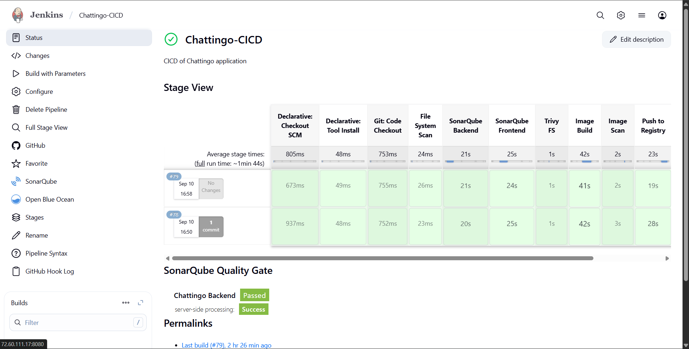
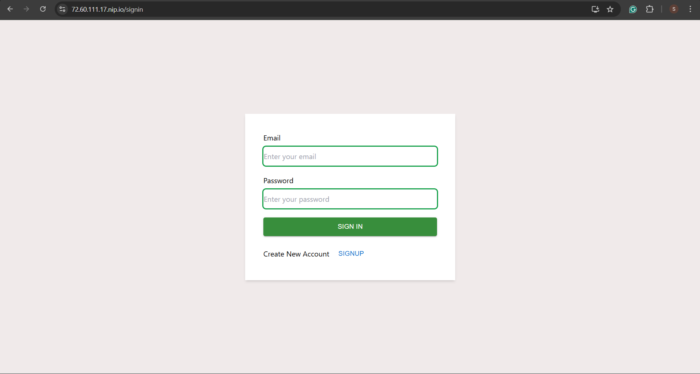
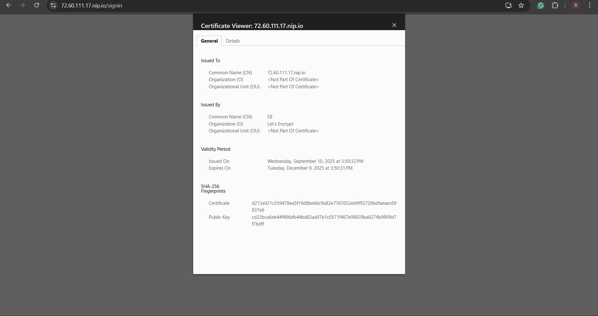
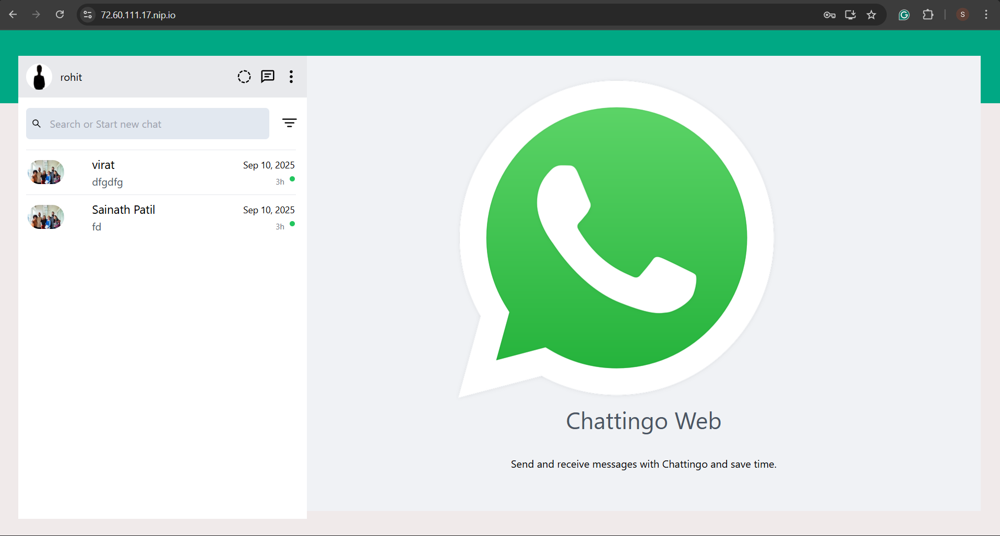

<div align="center">
  
  
  
  
  
  
</div>
<div align="center">
  <h3>🔗 <a href="https://72.60.111.17.nip.io/">Live Application</a> | 🎥 <a href="https://drive.google.com/file/d/1wIvIXvkbWz5M7ZjSQiz4rVkY3fpE1lmA/view?usp=sharing">Demo Video</a> | 📖 <a href="YOUR_BLOG_URL_HERE">Technical Blog</a></h3>
</div>

---

## **📋 Table of Contents**


## **🎯 Project Overview**
**Chattingo is a modern, production-ready real-time chat application that demonstrates enterprise-level DevOps practices. This project was developed as part of the Mini Hackathon Challenge, transforming a vanilla application into a fully containerized, automatically deployed system.**

## **🎖️ Competition Objectives Achieved**
- ✅ **Containerization:** Multi-stage Docker builds for optimal performance
- ✅ **CI/CD Pipeline:** Comprehensive Jenkins automation with security scanning
- ✅ **Production Deployment:** Hostinger VPS with HTTPS and domain configuration
- ✅ **Security:** SSL certificates, vulnerability scanning, and secure practices
- ✅ **Documentation:** Comprehensive guides and video demonstrations

## **🏗️ Architecture**
<p align="center">
    
</p>

## **🔄Communication Flow**
1. **Frontend (React)** serves the user interface with real-time WebSocket connections
2. **Nginx** acts as a reverse proxy, handling SSL termination and static file serving
3. **Spring Boot** provides REST APIs and WebSocket endpoints for real-time messaging
4. **MySQL** persists user data, chat rooms, and message history
5. **Jenkins** automates the entire deployment pipeline with security checks

## **DevOps & Infrastructure**

| Technology      | Purpose                | Implementation                                    |
|-----------------|------------------------|---------------------------------------------------|
| Docker          | Containerization       | Multi-stage builds for optimization               |
| Docker Compose  | Orchestration          | Multi-container application management            |
| Jenkins         | CI/CD Pipeline         | Automated build, test, scan, and deploy           |
| Nginx           | Web Server             | Reverse proxy with SSL termination                |
| Let's Encrypt   | SSL Certificates       | Automated HTTPS configuration                     |
| Hostinger VPS   | Hosting                | Ubuntu 22.04 LTS production server                |


## **🐳 Docker Implementation**

- **Multi-stage builds** minimize image size and improve security.
- **Separate stages** for dependencies, build, and runtime.
- **Environment variables** for configuration flexibility.
- **Efficient caching** for faster builds.
- **Production-ready images** with only necessary files.


### **📁 Frontend Dockerfile (Multi-stage Build)**

```sh
# -------------------
# Stage 1: Dependencies (Node.js)
# -------------------
FROM node:18-alpine AS deps

WORKDIR /app

# Install dependencies only
COPY package*.json ./
RUN npm install


# -------------------
# Stage 2: Build React app
# -------------------
FROM node:18-alpine AS build

WORKDIR /app

# Copy installed deps from deps stage
COPY --from=deps /app/node_modules ./node_modules

# Copy all source code
COPY . .

# Pass API URL at build time
ARG REACT_APP_API_URL
ENV REACT_APP_API_URL=${REACT_APP_API_URL}

# Build React app
RUN npm run build


# -------------------
# Stage 3: Nginx runtime
# -------------------
FROM nginx:stable-alpine AS production

# Remove default nginx static assets
RUN rm -rf /usr/share/nginx/html/*

# Copy built React app
COPY --from=build /app/build /usr/share/nginx/html

# (Optional) custom nginx.conf
COPY nginx.conf /etc/nginx/conf.d/default.conf

EXPOSE 80

CMD ["nginx", "-g", "daemon off;"]

```

**Build & Run:**
```sh
docker build --build-arg REACT_APP_API_URL=<example.com> \
  -t chattingo-frontend:latest .


docker run -d \
  -p 30080:80 \
  --name chattingo-frontend \
  chattingo-frontend:latest
```

### **📁 Backend Dockerfile (Multi-stage Build)**

```sh
# -------------------
# Stage 1: Maven build environment
# -------------------
FROM maven:3.9.6-eclipse-temurin-17 AS build

WORKDIR /app

# Copy pom.xml and download dependencies first (for caching)
COPY pom.xml .
RUN mvn dependency:go-offline -B

# Copy source code and build the jar
COPY src ./src
RUN mvn clean package -DskipTests


# -------------------
# Stage 2: Extract built application
# -------------------
FROM eclipse-temurin:17-jre-alpine AS extract

WORKDIR /app

# Copy jar from previous stage
COPY --from=build /app/target/*.jar app.jar

# Optional: explode jar (faster startup, smaller layers)
RUN java -Djarmode=layertools -jar app.jar extract


# -------------------
# Stage 3: JRE runtime
# -------------------
FROM eclipse-temurin:17-jre-alpine AS production

WORKDIR /app

# Copy layers from extract stage
COPY --from=extract /app/dependencies/ ./
COPY --from=extract /app/spring-boot-loader/ ./
COPY --from=extract /app/snapshot-dependencies/ ./
COPY --from=extract /app/application/ ./

# Copy .env (optional, you can also use docker-compose or k8s secrets)
# COPY .env .env

# Expose backend port
EXPOSE 8080

# Run Spring Boot app
ENTRYPOINT ["java", "org.springframework.boot.loader.launch.JarLauncher"]

```

**Build & Run:**
```sh
docker build -t chattingo-backend:latest .


docker run -d \
  --env-file .env \
  -p 30800:8080 \
  --name chattingo-backend \
  chattingo-backend:latest

```

### **🎼 Docker Compose Configuration**
```sh
version: "3.9"

services:
  db:
    image: mysql:8.1
    container_name: chattingo-db
    env_file:
      - ./backend/.env         # <-- load same env file for db
    ports:
      - "3307:3306"
    volumes:
      - db-data:/var/lib/mysql
    healthcheck:
      test: ["CMD", "mysqladmin", "ping", "-h", "localhost", "-p${MYSQL_ROOT_PASSWORD}"]
      interval: 10s
      timeout: 5s
      retries: 5
      start_period: 20s

  backend:
    build:
      context: ./backend
      dockerfile: Dockerfile
    image: wiings09/chattingo-backend:${TAG}
    container_name: chattingo-backend
    env_file:
      - ./backend/.env
    ports:
      - "30800:8000"
    depends_on:
      - db

  frontend:
    build:
      context: ./frontend
      dockerfile: Dockerfile
    image: wiings09/chattingo-frontend:${TAG}
    container_name: chattingo-frontend
    environment:
      - REACT_APP_API_URL=<domain.com>
    ports:
      - "30080:80"

volumes:  
  db-data:

```
**Run**
```sh
docker compose up -d
```
Note: *use --build for rebuild from scretch*

## **🔄 CI/CD Pipeline**

### **🏗️ Jenkins Pipeline**
- **Note:** view pipeline in project root directory

This is a CI/CD pipeline written in Jenkins Declarative Pipeline format. It automates the entire workflow from code checkout to deployment of your Chattingo application.

**Key Features of the Pipeline**

**1. Tools**
- Uses JDK 17 and Maven 3 for backend Java builds.
- Prepares the environment for building and testing both backend (Spring Boot) and frontend (React).

**2. Environment Variables**
- `REGISTRY`, `FRONTEND_IMAGE`, `BACKEND_IMAGE` = Docker registry and image names.
- `TAG` = Unique build identifier (build number)
- `BACKEND_DIR`, `FRONTEND_DIR` = Paths to source code
- `SONAR_HOME` = Location of SonarQube tool.

**3. Parameters**
- `IMAGE_TAG` = Allows manual override of Docker image tags.

**4. Stages**

**Stage 1: Git Checkout**
- Clones your repository from GitHub.

**Stage 2: File System Scan (Parallel)**
- **SonarQube Backend**
    - Analyzes backend code for bugs, code smells, vulnerabilities, test coverage.

- **SonarQube Frontend**
    - Analyzes frontend code similarly.

- **Trivy FS**
    - Scans filesystem and dependencies for security vulnerabilities (CVEs).

- ✅ Running these in parallel saves build time and ensures code quality + security checks early.

**Stage 3: Docker Image Build**
- Builds Docker images for frontend and backend.

**Stage 4: Image Scan**
- Scans the built Docker images using Trivy.
- Ensures that images don’t contain vulnerable packages before pushing to registry

**Stage 5: Push to Registry**
- Pushes Docker images to your Docker Hub using credentials stored in Jenkins.

**Stage 6: Deploy**
- Uses `docker-compose` to deploy the latest images on the VPS.
- Injects environment variables like database credentials, JWT secrets, CORS config, etc.

**5. Post Actions**
- Prints success or failure messages depending on the outcome of the pipeline.

### **Why SonarQube and Trivy are used**

| Tool          | Purpose in Pipeline                                                                                                                                 |
| ------------- | --------------------------------------------------------------------------------------------------------------------------------------------------- |
| **SonarQube** | Performs **static code analysis**. Detects **bugs, code smells, complexity, and test coverage**. Improves code quality before deployment.           |
| **Trivy**     | Performs **security scanning**. Checks for **vulnerabilities in dependencies, filesystem, and Docker images**. Ensures safe and secure deployments. |

**In short:**
```sh
SonarQube → Code Quality

Trivy → Security
```
## **DNS Resolution**
For DNS resolution, I have used [nip.io](https://nip.io), which provides wildcard DNS mapping for IP addresses. This allows easy access to deployed services using URLs like `<your-server-ip>.nip.io` without manual DNS configuration.

## **SSL Certificate**

I have used **Let's Encrypt** with **Certbot** to automatically generate and install SSL certificates for secure HTTPS access. Certbot simplifies certificate management and renewal, ensuring encrypted communication for all services.

### **Installation and setup of SSL**
**Note:** setup is done on server
```sh
sudo apt update
sudo apt install certbot python3-certbot-nginx -y


sudo ln -s /etc/nginx/sites-available/chattingo.conf /etc/nginx/sites-enabled/  
sudo nginx -t
sudo systemctl restart nginx

# Issue Certificate
sudo certbot --nginx -d <example.com> # your domain

# Verify SSL
https://example.com     # your domain
```

## **NGINX Reverse Proxy**

- I have configured NGINX on my VPS server to act as a reverse proxy for the application.
- Incoming requests to routes such as `/`, `/api/`, `/auth`, and `/ws` are automatically forwarded by NGINX to the appropriate backend services.
- This setup ensures that all traffic is securely and efficiently routed to the correct part of the application, providing seamless access for users and enabling features like SSL termination and load balancing.

<p align="center">
    
</p>

## **🎥 Demo & Screenshots**

### **📺 Video Demonstration**
[Watch the demo video here](YOUR_VIDEO_URL_HERE)

### **📸 Application Screenshots**

<p align="center">
    
</p>
<p align="center">
    
</p>
<p align="center">
    
</p>
<p align="center">
    
</p>

---

## **🤝 Contributing**
This project was developed for the Mini Hackathon Challenge. Future contributions are welcome!

**🔄 Development Workflow**

- Fork the repository
- Create a feature branch: `git checkout -b feature/amazing-feature`
- Commit changes: `git commit -m 'Add amazing feature'`
- Push to branch: `git push origin feature/amazing-feature`
- Open a Pull Request

---

## **📞 Contact**
**Name:** Sainath Patil  
**Email:** sainathpatil090@gmail.com  
**LinkedIn:** [\[Your LinkedIn Profile\]](https://www.linkedin.com/in/sainath-patil-00644a252/)  
**GitHub:** [[Your GitHub Profile](https://github.com/sainathPatil09)]

## **🔗 Project Links**

- 🌐 **Live Application:** [[LIVE_URL_HERE](https://72.60.111.17.nip.io/)]
- 📁 **GitHub Repository:** [[REPO_URL_HERE](https://github.com/sainathPatil09/chattingo)]
- 🎥 **Demo Video:** [YOUR_VIDEO_URL_HERE](https://drive.google.com/file/d/1wIvIXvkbWz5M7ZjSQiz4rVkY3fpE1lmA/view?usp=sharing)
- 📖 **Technical Blog:** [YOUR_BLOG_URL_HERE]